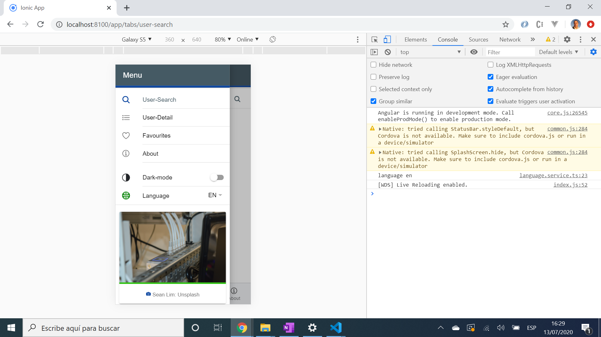

# :zap: Ionic Angular Github

* App to search for and display github data for a user from the [github API](https://developer.github.com/v3/search/#search-repositories) using the [Ionic 5 framework](https://ionicframework.com/docs).

## :page_facing_up: Table of contents

* [:zap: Ionic Angular Github](#zap-ionic-angular-github)
  * [:page_facing_up: Table of contents](#page_facing_up-table-of-contents)
  * [:books: General info](#books-general-info)
  * [:camera: Screenshots](#camera-screenshots)
  * [:signal_strength: Technologies](#signal_strength-technologies)
  * [:floppy_disk: Setup](#floppy_disk-setup)
  * [:computer: Code Examples](#computer-code-examples)
  * [:cool: Features](#cool-features)
  * [:clipboard: Status & To-do list](#clipboard-status--to-do-list)
  * [:clap: Inspiration](#clap-inspiration)
  * [:envelope: Contact](#envelope-contact)

## :books: General info

* The [Github API](https://angular.io/) has a lot more detailed functionality available:

## :camera: Screenshots



## :signal_strength: Technologies

* [Ionic v5](https://ionicframework.com/)
* [Angular v10](https://angular.io/)
* [Ionic/angular v5](https://www.npmjs.com/package/@ionic/angular)
* [github API](https://developer.github.com/v3/search/#search-repositories)

## :floppy_disk: Setup

* To start the server on _localhost://8100_ type: 'ionic serve' ()

## :computer: Code Examples

* tba

```typescript

```

## :cool: Features

* tba

## :clipboard: Status & To-do list

* Status: Working. Very basic.
* To-do: Change search result page to be a user profile with number of repos etc and a photo. Add user repo detail page.

## :clap: Inspiration

* none

## :envelope: Contact

* Repo created by [ABateman](https://www.andrewbateman.org) - you are welcome to [send me a message](https://andrewbateman.org/contact)
